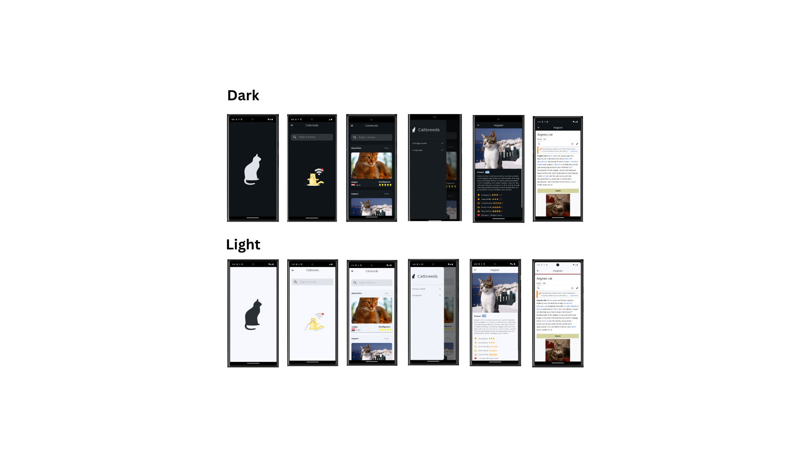

# 🐱 Cats App

## 📌 Descripción

**Cats App** es una aplicación móvil desarrollada en **Flutter** siguiendo los principios de **Clean Architecture**. La aplicación permite visualizar diferentes razas de gatos con imágenes y detalles de cada una, utilizando datos de una API.

## 🛠️ Tecnologías y Herramientas

- **Flutter** 🐦
- **Dart** 🎯
- **Riverpod** (Manejo de estado)
- **Dio** (Consumo de API)
- **Freezed** (Generación de modelos inmutables)
- **JSON Serialization** (Serialización de datos)
- **GoRouter** (Navegación)
- **SliverList** (Optimización de listas)

## 📂 Arquitectura

Este proyecto sigue **Clean Architecture**, dividiendo la aplicación en capas por cada feature:

```
lib/
│── core/           # Configuraciones globales, utilidades y temas
│── data/           # Fuente de datos (API, base de datos local)
│── domain/         # Entidades y casos de uso
│── presentation/   # UI y lógica de presentación (Providers, Widgets, Screens)
└── main.dart       # Punto de entrada de la aplicación
```

## 🚀 Instalación y Ejecución

1. Clona este repositorio:
   ```sh
   https://github.com/alejopp/cat_catcher_app.git
   ```
2. Navega al directorio del proyecto:
   ```sh
   cd cat_catcher_app
   ```
3. Instala las dependencias:
   ```sh
   flutter pub get
   ```
4. Crea un archivo **.env** en la raíz del proyecto y agrega tu API Key:
   ```env
   API_KEY=tu_api_key_aqui
   ```
5. Ejecuta la aplicación:
   ```sh
   flutter run
   ```

## 📡 API

La aplicación consume datos de **The Cat API**:

- URL: [https://api.thecatapi.com/v1/breeds](https://api.thecatapi.com/v1/breeds)

Para acceder a la API, asegúrate de configurar tu API Key en un archivo **.env** y cargarlo correctamente en la aplicación.

## 🧪 Pruebas

El proyecto cuenta con **tests unitarios** para validar la funcionalidad de:

- **Datasource**: Pruebas sobre la obtención de datos desde la API.
- **UseCase**: Validación de la lógica de negocio aplicada a los datos.

Para ejecutar las pruebas, usa el siguiente comando:
```sh
flutter test
```

## 📸 Capturas de Pantalla



## 📄 Licencia

Este proyecto está bajo la licencia **MIT**.

---

Desarrollado por Alejandro Peláez Posada (APP)

